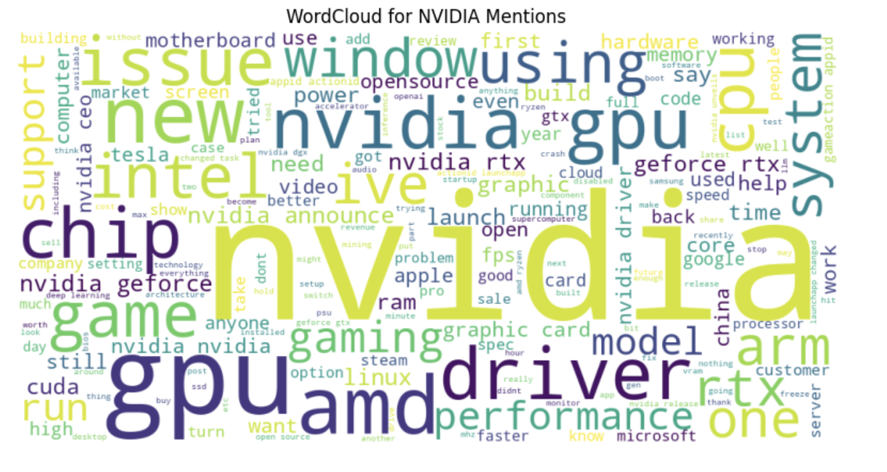

# NVIDIA Public Perception Analysis using NLP

## Overview
This project analyzes public discussions about **NVIDIA** across online platforms using **Natural Language Processing (NLP)** techniques. The goal is to understand the sentiment and key topics associated with the company and its products. This can help NVIDIA identify areas of strength, potential issues, and overall market perception.

**Data Source:**  
- Reddit (via API): Posts mentioning NVIDIA  
- HackerNews (via API): Stories discussing NVIDIA  

---

## Data Capture

- **Reddit:** 1,000 posts were fetched using a search API.
- **HackerNews:** 1,000 stories were retrieved from the HackerNews API.
- Both datasets were merged to create a comprehensive collection of public discussions.

Combining multiple sources provides a more complete picture of public opinion and reduces platform-specific bias.

---

## Data Cleaning and Preprocessing

Steps taken to prepare the text data:

1. **Merge Titles and Body Text:** Created a single field combining the post title and content.  
2. **Remove Duplicates:** Ensured each post is unique.  
3. **Clean Text:**  
   - Converted text to lowercase  
   - Removed URLs and non-alphabetic characters  
   - Removed stopwords  
   - Lemmatized words (reduced words to their root form)

Cleaned text improves NLP analysis and ensures models focus on meaningful words rather than noise.

---

## Exploratory Analysis

### Word Cloud
A WordCloud visualization highlights the most frequently mentioned words related to NVIDIA.  
- Frequent words include **GPU**, **AI**, **gaming**, and **performance**, indicating key discussion areas.  

### Sentiment Analysis
- Used **VADER Sentiment Analyzer** to score each post.  
- Distribution of sentiment scores shows most discussions are **neutral**, with slightly more **positive** mentions than negative.  

**Summary Metrics:**
- Total Posts: 2,000+  
- Average Sentiment: Slightly positive  
- Positive Posts: Highlight achievements and AI innovations  
- Negative Posts: Focus on driver issues and technical challenges  
- Neutral Posts: Most factual discussions about products and news

---

## Topic Modeling

- Applied **Sentence-BERT embeddings** to capture semantic meaning of text.  
- Used **BERTopic** to cluster posts into topics.  

**Top Topics Identified:**
1. NVIDIA AI and Machine Learning  
2. Gaming GPU Performance  
3. Product Updates and Releases  
4. Driver and Software Issues  
5. Market News and Stock Performance  

*Insights:*  
- Positive topics center around AI and gaming innovations.  
- Negative topics are mostly technical issues or corporate controversies.  
- Understanding these topics can help the company improve communication and address concerns proactively.

---

## Visualization

- **WordCloud:** Highlights most common words in posts.  
- **Sentiment Distribution Histogram:** Shows spread of positive, neutral, and negative sentiment.  
- **Topic Barchart and Heatmap:** Displays most discussed topics and their relationships.

---

## Tools and Libraries
- Python 3.x
- `pandas`, `numpy`  
- `requests` (for API data capture)  
- `nltk` (stopwords, lemmatization, sentiment analysis)  
- `matplotlib`, `seaborn`, `wordcloud` (visualizations)  
- `sentence-transformers`, `BERTopic` (topic modeling)  

---

## Key Takeaways
1. Public perception of NVIDIA is largely positive, focusing on **AI and gaming GPU performance**.  
2. Negative sentiment is mostly related to **technical issues** and **corporate challenges**.  
3. Topic modeling identifies **core discussion areas**, helping prioritize product improvements and communication strategies.  
4. Using multiple NLP techniques provides actionable insights for decision-making.

---

## References
- Reddit API: [https://www.reddit.com/dev/api](https://www.reddit.com/dev/api)  
- HackerNews API: [https://hn.algolia.com/api](https://hn.algolia.com/api)  
- NLP & Topic Modeling: Sentence-BERT, BERTopic documentation  
- WordCloud & Sentiment Analysis: NLTK, VADER
